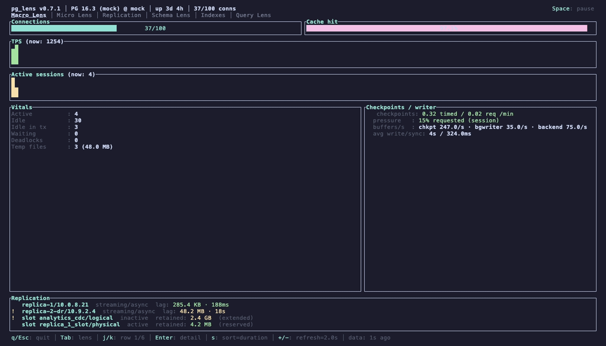
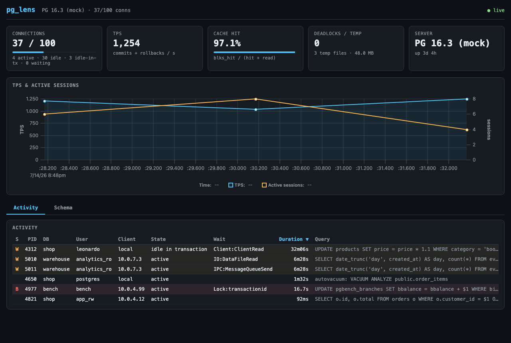

# pg_lens 🔬🐘

> **A blazing-fast, modern TUI for PostgreSQL observability.**
> *A microscopic view into your PostgreSQL performance.*

[](LICENSE)


`pg_lens` connects to a running PostgreSQL server (13+) and renders live
activity in your terminal — inspired by [pg_activity](https://github.com/dalibo/pg_activity)
and [btop](https://github.com/aristocratos/btop), built in Rust with
[ratatui](https://ratatui.rs) for minimal overhead: a **~4 MiB static
binary** that idles at **~7 MB of RSS** while monitoring a loaded server.



<details>
<summary>Web Lens dashboard (<code>pg_lens serve</code>)</summary>



</details>

## Features

- **Macro Lens** — instance vitals at a glance: connection saturation gauge,
  TPS with scrolling sparkline history, cache hit ratio, active sessions,
  deadlocks and temp-file counters, server uptime.
- **Micro Lens** — per-backend activity table: state, wait events, running
  duration, and a status marker for **blocked** (`B`, red) and **waiting**
  (`W`, yellow) sessions, powered by `pg_locks` + `pg_blocking_pids()`.
- **Query detail panel** — press `Enter` on any row to read the full SQL.
- **Resilient by design** — if the database goes down, pg_lens shows an
  error banner, keeps the last known data on screen, and reconnects with
  backoff. The UI never blocks on the database.
- **Live tuning** — adjust the poll interval on the fly with `+` / `-`
  (0.5s–10s).
- **Schema Lens (data layer)** — per-table `pg_stat_user_tables` counters
  and on-disk sizes, refreshed on a separate slow cadence (default 60s,
  `--schema-interval`) so they never tax the fast tick. **Estimated bloat
  is on-demand** — its queries are heavy, so they run only when you press
  `R` in the Schema Lens (never automatically, so connecting is instant).
  Bloat estimation uses queries adapted from
  [ioguix/pgsql-bloat-estimation](https://github.com/ioguix/pgsql-bloat-estimation)
  (BSD-2-Clause, attribution kept in the SQL headers). Methodology note:
  these are *statistics-based estimates*, not measurements — they rely on a
  reasonably fresh `ANALYZE`, underestimate TOASTed columns, and include
  unavoidable alignment padding; rows the estimator flags as `is_na`
  (e.g. `name`-typed columns, missing statistics) carry no numbers at all
  and are shown with a marker instead.
- **Query Lens (`pg_stat_statements`)** — top normalized statements by
  total execution time: calls, total/mean time, rows, and shared-buffer
  hit%, with SQL-highlighted query text and an `Enter` detail panel.
  Requires the `pg_stat_statements` **extension at version 1.8+** (the
  `total_exec_time` schema, shipped with PostgreSQL 13); when it is missing
  or too old the lens shows a friendly explainer with the exact
  `CREATE EXTENSION` / `shared_preload_libraries` steps instead of an
  error. Scope is the **current database only** (the extension is
  cluster-wide); collection shares the Schema Lens slow cadence, and `R`
  force-refreshes both. `queryid` is exposed as a string in the JSON API —
  the raw int8 can exceed JavaScript's safe-integer range.
- **Replication** — the Macro Lens shows a compact **Replication** summary
  (capped, with a "Tab → Replication for all" hint once it clips) alongside
  a dedicated **Replication Lens** tab with the full, never-clipped picture:
  every WAL sender/receiver (`pg_stat_replication` state, sync mode, replay
  lag in both bytes and time) and every replication slot as a scrollable
  table (active/inactive, retained WAL, `wal_status`, safe WAL size). Lag
  and slot severity are tiered yellow/red with a textual `!`/`!!` marker; a
  replica 0 bytes behind is always "caught up" even if a primary has been
  idle for minutes (the time-based measure is unreliable there). The lag
  columns of `pg_stat_replication` require the `pg_monitor` role or
  superuser — a non-privileged user simply sees no replicas.
- **Index Lens** — a dedicated tab for the unused/duplicate/prefix-redundant
  index advisor: severity-ranked findings (`UNUSED` red, `DUP` yellow,
  `prefix` dim-yellow), an `Enter` detail panel with the verbatim
  `CREATE INDEX` statement and the duplicate partner spelled out as
  evidence, and a footer naming the stats-reset age — an `idx_scan = 0`
  claim means nothing right after a reset.
- **Problem-transaction hunting** — a transaction-age column and headline
  for the oldest `idle in transaction` / long-running session (yellow/red
  age tiers), a blocking-chain view (`A→B→C`, root blocker highlighted,
  deadlock-cycle warning) in the Micro Lens detail panel, and an orphaned
  two-phase-commit (`pg_prepared_xacts`) watch inside the Vacuum sub-view —
  all three are common causes of XID-wraparound and lock pile-ups. TUI + Web.
- **Idle connection / connection-age census** — press `I` in the Micro Lens
  to see the idle sessions the activity table normally filters out, ranked
  oldest-first with a headline — the diagnostic for the classic
  pool-exhaustion incident (connections near `max_connections`, few of them
  active). TUI + Web.
- **Lock-table pressure gauge** — a third Macro Lens vitals gauge showing
  held locks against the cluster's effective capacity, yellow/red before
  you hit "out of shared memory, you might need to increase
  max_locks_per_transaction". TUI + Web.
- **Invalid index detection** — the Index Lens flags indexes left behind by
  a failed `CREATE INDEX CONCURRENTLY` (`INVALID`, ranked first) — wasted
  write I/O and disk serving no query, something `\d` never warns about.
  TUI + Web.
- **`psql` shell launch** (`!`, TUI-only) — jump straight from the session
  you're inspecting into an interactive `psql` shell on the same
  connection; see [The `psql` shell](#the-psql-shell).
- **Direct tab jump & fast scroll** — `1`–`6` jump straight to a lens,
  `Shift+Tab` cycles backward, `Backspace` returns to the previously active
  lens, and `Home`/`g`, `End`/`G`, `PageUp`/`PageDown` fast-scroll every
  selectable table.
- **Schema and Query Lens filters** — the `/` filter, previously
  Micro-Lens-only, now also narrows the Schema Lens Tables view (by
  schema/table name) and the Query Lens (by query text), each with
  independent state; `\` clears whichever lens's filter is active. TUI +
  Web.
- **Modern Web Lens dashboard** — a redesigned dashboard: sidenav, a
  database switcher, a light/dark theme toggle, and full keyboard
  navigation; see [Web Lens](#web-lens).
- **Keyboard help overlay** — press `?` for a full reference of every
  binding, grouped by navigation / sub-views / data / admin / quit.
- **Read-only mode** — `--read-only` / `PG_LENS_READ_ONLY` / config.toml
  hard-disables `c`/`K` and the web admin endpoints server-side (not just
  hidden in the UI) for shared or audited deployments. See
  [Read-only mode](#read-only-mode).
- **Remote connection config** — point pg_lens at a shared `services.toml`
  hosted in a (private) GitHub repo or any HTTPS URL, so a team uses one
  curated target list instead of copying the file by hand. See
  [Remote connection config](#remote-connection-config).
- **Version-aware queries** — dedicated query sets for PostgreSQL 13, 14+,
  and 16+, following pg_activity's versioning convention.
- **Single static binary** — no runtime, no dependencies; musl builds run
  on any Linux, including Alpine containers.

## Installation

### Homebrew (macOS / Linux)

```sh
# macOS — cask (prebuilt binary, no Xcode/CLT required):
brew install --cask dog-hero/tap/pg_lens

# Linux (Homebrew on Linux) — formula:
brew install dog-hero/tap/pg_lens
```

The [tap](https://github.com/dog-hero/homebrew-tap) serves the prebuilt
release binaries and is updated automatically by the release workflow.

macOS notes (until the binaries are notarized with an Apple Developer
ID): use the **cask** — plain formulas from a tap run Homebrew's
source-build preflight and fail with "Your Xcode is too outdated" on
fresh systems (even though nothing is compiled). The cask skips that
check, and it clears the Gatekeeper quarantine attribute itself on
install (a cask `postflight`), so the unsigned binary just runs. If
macOS still refuses it, clear the flag once:

```sh
xattr -d com.apple.quarantine "$(brew --prefix)/bin/pg_lens"
```

### Prebuilt binaries (releases)

Download the archive for your platform from the
[releases page](https://github.com/dog-hero/pg_lens/releases). On macOS,
prefer `curl` — browser downloads get the quarantine attribute and
Gatekeeper will refuse to run the unsigned binary:

```sh
# macOS (Apple Silicon)
curl -L https://github.com/dog-hero/pg_lens/releases/download/v0.7.1/pg_lens-v0.7.1-aarch64-apple-darwin.tar.gz | tar xz
./pg_lens-v0.7.1-aarch64-apple-darwin/pg_lens --mock
```

If you already downloaded it with a browser and macOS says the app
"cannot be verified", clear the quarantine flag once:

```sh
xattr -d com.apple.quarantine ./pg_lens
```

(The binaries are not yet signed/notarized with an Apple Developer ID —
building from source or installing via curl avoids the prompt entirely.)

### Docker (GHCR)

> **Note:** image publishing is currently **paused** during active
> development (the arm64 build under QEMU makes releases too slow) — the
> latest available tag may lag the newest release. It will resume on a
> native arm64 runner; meanwhile prefer the binaries/packages above.

Multi-arch images (linux/amd64 + linux/arm64) are published to
[GHCR](https://github.com/dog-hero/pg_lens/pkgs/container/pg_lens). The
default command serves the [Web Lens](#web-lens) dashboard on
`0.0.0.0:8080`:

```sh
docker run --rm -p 8080:8080 \
  -e PG_LENS_AUTH_TOKEN="$(openssl rand -hex 32)" \
  -e PGHOST=db.internal -e PGUSER=monitor -e PGPASSWORD=secret \
  ghcr.io/dog-hero/pg_lens
```

**`PG_LENS_AUTH_TOKEN` is required for the default command**: pg_lens
refuses to bind a non-loopback address without a token (a container has
to listen beyond loopback to be reachable, so the image inherits that
gate). Without the env var the container exits immediately with
`refusing to listen on non-loopback address 0.0.0.0:8080 without
authentication`. With it, every `/api` route requires
`Authorization: Bearer <token>`.

Connection settings come from the standard libpq env vars (`PGHOST`,
`PGPORT`, `PGUSER`, `PGPASSWORD`, ...) or any `pg_lens` flag appended to
the run command. A minimal compose file:

```yaml
services:
  db:
    image: postgres:16
    environment:
      POSTGRES_PASSWORD: pg
    healthcheck:
      test: ["CMD-SHELL", "pg_isready -U postgres"]
      interval: 5s
      timeout: 3s
      retries: 10
  pg_lens:
    image: ghcr.io/dog-hero/pg_lens:latest
    ports: ["8080:8080"]
    environment:
      PG_LENS_AUTH_TOKEN: change-me
      PGHOST: db
      PGUSER: postgres
      PGPASSWORD: pg
    depends_on:
      db:
        condition: service_healthy
```

The entrypoint is the `pg_lens` binary itself, so any arguments replace
the default `serve` command — the TUI works too:

```sh
docker run -it --rm ghcr.io/dog-hero/pg_lens tui \
  --dsn "host=db.internal user=monitor password=secret"
```

The image runs as `nobody` (uid 65534) on Alpine. `sh` is present, so
the [services file](#services-file)'s `password_cmd` works — mount the
file readable by uid 65534 and pass
`--services-file /path/to/services.toml --service <name>`.

### deb / rpm (Linux servers)

Every release attaches `.deb` and `.rpm` packages (amd64 + arm64), built
with [nfpm](https://nfpm.goreleaser.com) from the same static musl
binaries as the tarballs. The package is named `pg-lens` (Debian policy
forbids `_` in package names); it installs `/usr/bin/pg_lens` plus docs
and has no dependencies.

```sh
# Debian / Ubuntu (pick amd64 or arm64)
curl -LO https://github.com/dog-hero/pg_lens/releases/download/v0.7.1/pg-lens_0.7.1_amd64.deb
sudo dpkg -i pg-lens_0.7.1_amd64.deb

# RHEL / Fedora / SUSE (x86_64 or aarch64)
curl -LO https://github.com/dog-hero/pg_lens/releases/download/v0.7.1/pg-lens-0.7.1-1.x86_64.rpm
sudo rpm -i pg-lens-0.7.1-1.x86_64.rpm    # or: sudo dnf install ./pg-lens-0.7.1-1.x86_64.rpm
```

### Cargo (crates.io)

```sh
cargo install pg_lens_tui          # compiles; installs the `pg_lens` binary
cargo binstall pg_lens_tui         # fetches the prebuilt release binary, no compile
```

The published crate carries the built web dashboard, so `cargo install`
needs no Node toolchain. `cargo binstall` reads the release tarballs
directly (see `[package.metadata.binstall]`).

### From source

Requires Rust (edition 2024, tested with cargo 1.93):

```sh
git clone git@github.com:dog-hero/pg_lens.git
cd pg_lens
cargo build --release -p pg_lens_tui
./target/release/pg_lens --mock   # instant demo, no database needed
```

### Static Linux binaries (musl)

No host toolchain setup needed — build inside Docker:

```sh
# aarch64 (arm64 hosts)
docker run --rm -v "$PWD":/work -w /work -e CARGO_TARGET_DIR=/work/target-musl \
  rust:1-alpine sh -c 'apk add -q musl-dev && cargo build --release -p pg_lens_tui'

# x86_64 (from an arm64 host, via emulation)
docker run --rm --platform linux/amd64 -v "$PWD":/work -w /work \
  -e CARGO_TARGET_DIR=/work/target-musl-amd64 \
  rust:1-alpine sh -c 'apk add -q musl-dev && cargo build --release -p pg_lens_tui'
```

With rustup available (e.g. in CI), the leaner recipe is
`rustup target add {x86_64,aarch64}-unknown-linux-musl` +
[`cargo-zigbuild`](https://github.com/rust-cross/cargo-zigbuild) or
[`cross`](https://github.com/cross-rs/cross).

## Usage

```sh
pg_lens --dsn "host=localhost port=5432 user=postgres password=..." [--interval 2]
pg_lens --mock          # built-in mock data (dev/demo mode)
```

| Flag / env | Meaning |
|---|---|
| `--dsn <DSN>` | Connection string: `key=value` DSN or `postgres://` URL. Also read from the `PG_LENS_DSN` env var. Optional — see [Connecting](#connecting) |
| `--service <name>` | Connect using a named entry from the [services file](#services-file). Also read from `PG_LENS_SERVICE`, falling back to `PGSERVICE`. Mutually exclusive with `--dsn` |
| `--services-file <path>` | Services file location. Default: `$XDG_CONFIG_HOME/pg_lens/services.toml` (or `~/.config/pg_lens/services.toml`). Also read from `PG_LENS_SERVICES_FILE` |
| `--list-services` | Print the defined services (names + host/user, never secrets) and exit |
| `--interval <secs>` | Poll interval in seconds (minimum 0.5). Default: 2 |
| `--mock` | Use built-in mock data instead of a real database |
| `--read-only` | Hard-disable admin actions (`c`/`K` in the TUI, `/api/admin/*` in the web server) — enforced server-side, not just hidden. Also `PG_LENS_READ_ONLY` env (any value other than empty/`0`/`false`/`no`/`off`, case-insensitive) or `read_only = true` in [config.toml](#config-file). See [Read-only mode](#read-only-mode) |
| `--config-url <URL>` | Load a shared `services.toml` from a remote source: `github:OWNER/REPO/PATH[@REF]` or a plain `https://`/`http://` URL. Also `PG_LENS_CONFIG_URL` env or `remote_config` in config.toml. See [Remote connection config](#remote-connection-config) |

> **Tip:** for production monitoring, use a read-only role granted the
> [`pg_monitor`](https://www.postgresql.org/docs/current/predefined-roles.html)
> predefined role in the DSN. See
> **[Creating the monitoring user & least-privilege grants](docs/connection-user.md)**
> for the exact role and the per-lens privilege map.

### Connecting

`pg_lens` resolves the connection the way `psql` does: any field the
`--dsn` sets wins; anything it leaves out falls back to the standard
[libpq environment variables](https://www.postgresql.org/docs/current/libpq-envars.html);
whatever is still missing gets the defaults `host=localhost user=postgres`.

```sh
# no --dsn at all — pure environment:
PGHOST=db.internal PGPORT=5432 PGUSER=pg_monitor_ro PGPASSWORD=... pg_lens

# mix and match — the DSN pins the host, the env supplies the password:
PGPASSWORD=... pg_lens --dsn "host=db.internal user=pg_monitor_ro"
```

| Env var | Maps to | Notes |
|---|---|---|
| `PGHOST` | `host` | hostname or Unix-socket directory |
| `PGPORT` | `port` | must be a valid TCP port |
| `PGDATABASE` | `dbname` | |
| `PGUSER` | `user` | default: `postgres` |
| `PGPASSWORD` | `password` | never displayed or logged |
| `PGAPPNAME` | `application_name` | |
| `PGCONNECT_TIMEOUT` | connect timeout | whole seconds; `0` = wait indefinitely |

**Precedence (highest first):** `--dsn` field → [services-file](#services-file)
entry → env var → default (`host=localhost`, `user=postgres`) — the same
order libpq uses. Empty env values count as unset. The header shows the
resolved `user@host` — the password never appears anywhere.

#### Connection poolers (PgBouncer / Supavisor / RDS Proxy)

pg_lens connects fine **directly**, through a **session-pooling** proxy, and as
a restricted non-superuser (managed services like RDS/Aurora/Cloud SQL). Each
poll runs in a short read-only transaction with its own `statement_timeout`, so
it is a good citizen on shared servers.

The one unsupported setup is a pooler in **transaction pooling** mode
(PgBouncer default `pool_mode = transaction`, Supabase's port `6543`,
Supavisor's transaction mode). There, the driver's prepared statements are
routed to different backends and fail. For a monitoring tool this is the wrong
mode anyway — point pg_lens at the **session/direct endpoint** instead
(Supabase: port `5432`), or run PgBouncer ≥ 1.21 with
`max_prepared_statements > 0`.

### Services file

For more than one database, register named services in
`~/.config/pg_lens/services.toml` (inspired by libpq's `pg_service.conf`,
with one extra trick: `password_cmd` runs an external command and uses its
stdout as the password, so the file never has to contain a secret):

```toml
[services.prod]
host = "db.prod.internal"
port = 5432
user = "pg_monitor_ro"
dbname = "app"
application_name = "pg_lens"
connect_timeout_secs = 5
password_cmd = "vault kv get -field=password secret/pg/prod"

[services.staging]
host = "db.staging.internal"
user = "postgres"
# sugar: a password of the form "$(...)" is treated as password_cmd
password = "$(op read op://infra/pg-staging/password)"

[services.local]
host = "localhost"
user = "postgres"
# macOS Keychain works too:
password_cmd = "security find-generic-password -s pg_local -w"
```

```sh
pg_lens --service prod       # or: PG_LENS_SERVICE=prod / PGSERVICE=prod
pg_lens --list-services      # names + host/user, never secrets
```

Any field a service leaves out falls through to the env vars and defaults
above; `--dsn` fields always win (and the `--dsn`/`--service` flags are
mutually exclusive). `password_cmd` runs as `sh -c <cmd>` with a 10s
timeout, and is **re-executed on every (re)connection attempt** — so
short-lived tokens (Vault leases, SSO helpers) keep working across
reconnects. If the command fails, the TUI stays alive and shows the error
(stderr, never stdout) in the banner, retrying with backoff.

### Remote connection config

For a team that wants everyone pointed at the same curated target list
instead of copying `services.toml` by hand, pg_lens can load it from a
remote source instead of (or layered on top of) the local file:

```sh
pg_lens --config-url "github:my-org/infra/pg_lens/services.toml@main"
pg_lens --config-url "https://config.internal.example.com/pg_lens/services.toml"
# or in config.toml:
# remote_config = "github:my-org/infra/pg_lens/services.toml@main"
```

Two forms are accepted:

- **`github:OWNER/REPO/PATH[@REF]`** — fetched via the GitHub Contents API
  (works for private repos with a token; `@REF` defaults to the repo's
  default branch).
- **A verbatim `https://`/`http://` URL** — fetched as-is.

The token is resolved in this order and is **never written to a file**:
`PG_LENS_CONFIG_TOKEN` env → `GITHUB_TOKEN` env → `remote_config_token_cmd`
in `config.toml` (an external command, trimmed stdout — the same pattern as
`password_cmd`), sent as `Authorization: Bearer <token>`. **A token is
refused outright over plain `http://`** — only `https://` (or the GitHub
API, which is always https) may carry one.

A successful fetch is cached at
`$XDG_CACHE_HOME/pg_lens/remote-services.toml` (mode `0600`). If the fetch
fails — network down, bad token, repo moved — pg_lens falls back to that
cache, then to the local services file, each step logging a one-line
warning to stderr; startup never blocks on a flaky network (10s timeout)
and only hard-fails when there is truly nothing to connect with. Remote
entries win a same-named collision with local entries; local-only entries
still work. The fetch is strictly **read-only** — pg_lens never writes
back to the remote source.

#### Interactive service picker

When the TUI starts with no connection hints at all — no `--dsn`, no
`--service`, and none of `PGHOST`/`PGSERVICE`/`PG_LENS_SERVICE`/`PG_LENS_DSN`
set (empty values count as unset) — and a valid services file with at least
one entry exists, pg_lens opens a picker instead of connecting blindly:
every service is listed as `name — user@host` (exactly what the file says,
never a secret), plus a final `localhost — (default)` entry for the plain
default resolution. `j`/`k`/`↑`/`↓` move, `Enter` connects, `q`/`Esc` quit.
If any part of that chain doesn't hold (a flag or env var is set, no file,
parse/permission error, zero services — or `--mock`/`serve`), behavior is
exactly as before: connect directly.

> **Security note:** this file can execute commands — treat it like code and
> keep it at `0600`. `pg_lens` refuses a services file that is writable by
> group/others, and refuses one that combines a plaintext `password` with
> group/other read permission. A plaintext `password` works but is
> discouraged; prefer `password_cmd`.

### Config file

Persistent defaults live in `~/.config/pg_lens/config.toml`
(`$XDG_CONFIG_HOME/pg_lens/config.toml`, or `PG_LENS_CONFIG_FILE`), next to the
services file. Every key is optional:

```toml
interval = 2.0          # poll interval, seconds (--interval)
schema_interval = 60    # Schema Lens cadence, seconds (--schema-interval)
listen = "127.0.0.1:8080"  # serve bind address (--listen)
read_only = false       # hard-disable admin actions (--read-only)
remote_config = "github:my-org/infra/pg_lens/services.toml@main"  # --config-url
# remote_config_token_cmd = "vault kv get -field=token secret/github/pg_lens"
```

Precedence, highest first: **flag → env var → config.toml → built-in default**
(`PG_LENS_INTERVAL`, `PG_LENS_SCHEMA_INTERVAL`, `PG_LENS_LISTEN`,
`PG_LENS_READ_ONLY`, `PG_LENS_CONFIG_URL`). A missing file is silently the
empty config; an unparsable one is ignored with a warning on stderr — a
broken config never stops pg_lens from starting.

### Persistent history

The TPS / active-sessions chart is backed by a ring that now **survives
restarts**: each sample is appended to
`~/.local/state/pg_lens/history-<host>_<port>_<db>.jsonl`
(`$XDG_STATE_HOME` if set), per connection target, and reloaded on start so
the chart resumes with prior data instead of a blank canvas. The default ring
holds an hour at the 2s poll. Persistence is entirely best-effort — a
read-only or full state directory just falls back to in-memory only, and the
file self-compacts so it never grows without bound.

### Keybindings

The in-app `?` overlay is the single source of truth for this table — if
they ever drift, trust the overlay.

| Key | Action |
|---|---|
| `Tab` / `Shift+Tab` | Cycle lenses forward / backward (Macro → Micro → Replication → Schema → Indexes → Queries → Macro) |
| `1`–`6` | Jump directly to a lens (numbers shown in the tab bar) |
| `Backspace` | Jump back to the previously active lens (browser-back style) |
| `j` / `↓` | Move selection down |
| `k` / `↑` | Move selection up |
| `g` / `Home` | Jump selection to the first row |
| `G` / `End` | Jump selection to the last row |
| `PgUp` / `PgDn` | Move selection by a page |
| `Enter` | Open/close the selected row's detail panel |
| `/` | Filter the current table — Micro Lens (pid, database, user, application, client, state, wait or query text), Schema Lens Tables view (schema/table name), or Query Lens (query text); each lens keeps its own filter state; `Enter` applies, `Esc` reverts |
| `\` | Clear the active lens's committed filter |
| `w` | Full waits panel (Micro Lens only) |
| `I` | Idle-connection census (Micro Lens only) — swaps the body to a list of idle sessions ranked oldest-first; `Esc` closes it |
| `v` | Vacuum sub-view (Schema Lens only) |
| `d` | Database picker (any lens) — reconnects the poller to the chosen database |
| `!` | Open a `psql` shell on the same connection (any lens) — see [The `psql` shell](#the-psql-shell) |
| `?` | Keyboard help overlay — lists every binding |
| `R` | Force schema/query-stats refresh (any lens) |
| `s` | Cycle sort column (Micro Lens / Schema Lens tables / Query Lens; inert on Index, Replication, and the Vacuum sub-view) |
| `+` / `=` | Increase the poll interval |
| `-` | Decrease the poll interval |
| `Space` | Pause / resume the display refresh (freeze for point-in-time analysis) |
| `c` | Cancel the selected session's query (`pg_cancel_backend`, Micro Lens) — asks for confirmation first |
| `K` | Terminate the selected session's backend (`pg_terminate_backend`, kills the connection, Micro Lens) — asks for confirmation first (uppercase on purpose; `k` stays navigation) |
| `y` / `n` | Confirm / abort — only while a confirm modal is open |
| `q` | Quit immediately |
| `Ctrl+C` | Quit immediately (works everywhere) |
| `Esc` | Close the topmost overlay (help → detail/waits/vacuum sub-view → db picker → filter revert → confirm abort); at the top level, press **twice within ~2s** to quit — a single stray `Esc` never exits |

> **Tip:** `c`/`K` need permission on the server side: PostgreSQL only lets
> you signal backends of the **same user**, or any backend if your role is a
> member of [`pg_signal_backend`](https://www.postgresql.org/docs/current/predefined-roles.html)
> (superusers can signal anything). Without it, pg_lens shows
> "gone or insufficient privilege" / the server's permission error in the
> feedback line. These actions are TUI-only — the web dashboard stays
> read-only by design.

### The `psql` shell

Press `!` (any lens, TUI only) to suspend pg_lens and drop into an
interactive `psql` shell on the exact same connection the poller is
using (host/port/user/dbname) — no need to retype connection details to
run a one-off query or `\d` a table. pg_lens restores the terminal cleanly
when `psql` exits, on a spawn failure, or if `psql` isn't found on `PATH`
(a clear inline message, not a crash — pg_lens does not require `psql` to
run otherwise). The password is never passed on the command line; it's
resolved as late as possible and handed to the child only via a
`PGPASSWORD` environment variable, matching the discipline pg_lens's own
connection resolution already uses (see
[Creating the monitoring user](docs/connection-user.md)).

Under `--read-only`, the shell launches with
`PGOPTIONS=-c default_transaction_read_only=on` (a default transaction
read-only mode) and pg_lens prints a notice alongside it — a full `psql`
session is definitionally unrestricted and can override that default
explicitly, so this is a nudge toward the read-only spirit, not a hard
sandbox. In `--mock` there's no real connection to hand `psql`, so `!`
shows a "not simulated" message instead of launching anything. Not
available from the Web Lens — there's no local terminal to suspend into.

### Read-only mode

For shared or audited deployments (or a role that intentionally lacks
`pg_signal_backend`, see
[Creating the monitoring user](docs/connection-user.md)), pg_lens can
hard-disable its two admin actions entirely:

```sh
pg_lens --read-only --dsn "..."
pg_lens serve --read-only --dsn "..."
```

Three equivalent config surfaces, same precedence as `--interval`
(flag → env → config.toml → default `false`): the `--read-only` flag,
the `PG_LENS_READ_ONLY` env var (any value other than empty/`0`/`false`/
`no`/`off`, case-insensitive), or `read_only = true` in
[config.toml](#config-file).

This is enforced **twice**, both server-side:

- **TUI** — `c`/`K` are refused before the confirmation modal ever opens
  (inline "read-only mode — action disabled" feedback), and a permanent
  yellow `RO` marker sits in the header so the mode is never silently
  active.
- **Web Lens** — `/api/admin/*` returns `403` even when a valid
  `PG_LENS_AUTH_TOKEN` is presented; a valid token no longer implies
  permission to act. `GET /api/config` exposes `{"read_only": true}` so
  the web frontend can grey out the cancel/terminate buttons and show a
  badge, but that is a UI convenience only — the `403` above is the real
  gate, checked before the token itself.

Schema/query-stats refresh (`R`) is **not** gated — it only ever opens a
read-only transaction. `pg_lens serve` inherits the same flag/env/config
resolution as the TUI.

## Architecture

Cargo workspace with a strict frontend-agnostic core:

```
              ┌──────────────────────────────────────┐
              │ pg_lens_core                         │
              │  poller ──► watch<Arc<DbSnapshot>>   │
              │  (versioned SQL, ring-buffer history)│
              └───────────────┬──────────────────────┘
                              │  last-value-wins, N consumers
                    ┌─────────┴──────────┐
                    ▼                    ▼
              pg_lens_tui          pg_lens_web (roadmap)
              ratatui / TEA        axum + SSE + TypeScript
```

- **`pg_lens_core`** — UI-free domain layer: serializable models, versioned
  SQL queries (adapted from pg_activity), `tokio-postgres` data access, the
  poller task, and a fixed-capacity ring buffer for metric history.
- **`pg_lens_tui`** — [The Elm Architecture](https://guide.elm-lang.org/architecture/)
  (model → update → view): a single `mpsc<Action>` channel aggregates
  keyboard input and snapshot updates; the render path is 100% synchronous
  and never awaits.

The poller publishes `Arc<DbSnapshot>` through a `tokio::sync::watch`
channel so any number of frontends can consume the same data — that is how
the upcoming web dashboard plugs in without touching the core.

## Development

```sh
cargo test --workspace                                   # unit + integration tests
cargo clippy --workspace --all-targets -- -D warnings    # lint gate (must be clean)
python3 scripts/e2e_pty.py                               # end-to-end TUI test on a real PTY (mock data)
python3 scripts/e2e_pty_live.py                          # end-to-end against a live PostgreSQL
```

To test against real PostgreSQL versions locally:

```sh
docker run -d --name pglens_pg16 -e POSTGRES_PASSWORD=pg -p 54316:5432 postgres:16
cargo run -p pg_lens_tui -- --dsn "host=localhost port=54316 user=postgres password=pg"
```

See [CLAUDE.md](CLAUDE.md) for architecture invariants and
[PLAN.md](PLAN.md) for the full development plan.

## Web Lens

`pg_lens serve` hosts the same Macro/Micro Lens as a live web dashboard —
vitals cards, a TPS/active-sessions chart (uPlot), and a sortable, filterable
activity table with blocked/waiting row highlighting — streamed over
Server-Sent Events from the same poller the TUI uses. It has near-parity with
the TUI: **pause** the live view, **refresh** the Schema Lens on demand,
**switch database**, and **cancel/terminate** backends. Admin actions are only
exposed when the server is started with `PG_LENS_AUTH_TOKEN` (the server
answers `403` otherwise) — the unauthenticated path stays read-only.

The dashboard uses a modern layout: a left sidenav (collapsing to an icon
rail ≤1024px and a horizontal strip ≤720px) and a topbar carrying the
connection target, the current database plus a switcher, the read-only
badge, pause, connection state, and a **light/dark theme toggle**
(persisted in `localStorage`, defaults to dark).

**Database switcher** — the topbar dropdown lists every database the
connected role can see and switches the poller to it (`POST
/api/db/switch`), gated the same way as schema refresh: token-required when
a token is configured, but **not** blocked by `--read-only` — a database
switch is a read-only reconnect, not a mutating action. It degrades to just
showing the current database name when the role can't see `pg_database` or
there's only one database.

**Keyboard navigation** — `1`–`5` jump to the nav sections, `/` focuses the
active panel's filter input, `Esc` blurs it; shortcuts are suppressed while
a text input has focus (except `Esc`).

<!-- TODO: screenshot of the web dashboard -->

### Quickstart

```sh
pg_lens serve --mock                      # demo data, http://127.0.0.1:8080
pg_lens serve --dsn "host=... user=..."   # against a real server
pg_lens serve --listen 127.0.0.1:9000     # different port (default 8080)
```

Open the printed address in a browser — the dashboard updates in real time
on every poll.

**Fail-loud on ambiguous services** — `serve` has no TTY to show the TUI's
interactive service picker. If a `services.toml` defines one or more
services and none is chosen (`--service` / `--dsn` / `PGSERVICE` /
`PG_LENS_SERVICE` / `PG_LENS_DSN` all unset), `pg_lens serve` refuses to
guess: it prints the available service names (host/user, never secrets) to
stderr and exits non-zero, instead of silently connecting to `localhost`.
Pass `--service <name>` (or `--dsn`) to disambiguate.

The frontend (Vite + TypeScript, `crates/pg_lens_web/frontend/`) is
embedded in the binary at compile time. Building with the `web` feature
(the default) therefore requires Node once, to produce the bundle:

```sh
cd crates/pg_lens_web/frontend && npm ci && npm run build
```

Skip the requirement entirely with a TUI-only build:
`cargo build -p pg_lens_tui --no-default-features`. Release binaries from
CI always ship with the web dashboard included.

### Authentication

Binding to anything other than loopback requires a token:

```sh
PG_LENS_AUTH_TOKEN=$(openssl rand -hex 32) pg_lens serve --listen 0.0.0.0:8080
```

All `/api/*` routes then require `Authorization: Bearer <token>` — the web
page prompts for the token on first load. Because the browser `EventSource`
API cannot set headers, `/api/*` also accepts `?token=<token>` as an
equivalent credential (same constant-time comparison). Trade-off: a token
in a URL can end up in reverse-proxy access logs and browser history —
treat it as a revocable secret, rotate it by restarting with a new value,
and never expose the server without TLS.

### Security notes

- **Read-only DSN**: connect with a role granted only
  [`pg_monitor`](https://www.postgresql.org/docs/current/predefined-roles.html)
  (`CREATE ROLE lens LOGIN PASSWORD '...'; GRANT pg_monitor TO lens;`) —
  the dashboard needs nothing more. Full per-lens privilege map:
  [Creating the monitoring user](docs/connection-user.md).
- **TLS**: the binary does not terminate TLS; put a reverse proxy (Caddy,
  nginx) in front for any non-localhost deployment.
- **Default bind is `127.0.0.1`** — exposure is an explicit operator
  decision, and refused without `PG_LENS_AUTH_TOKEN`.
- The DSN/password never appears in any endpoint, log line, or JSON payload.

## Roadmap

The full plan lives in [ROADMAP.md](ROADMAP.md) (product requirements in
[PRD.md](PRD.md)). Shipped so far: v0.7 "what should I go fix" (top waits,
vacuum health / XID-wraparound, index advisor, checkpointer panel), v0.8
"room to breathe" (Index/Replication Lens tabs, database selector, full
waits panel, Vacuum sub-view), v0.9 "problem transactions" (idle-in-tx
hunter, blocking-chain graph, prepared-transaction watch, keyboard help
overlay), v0.10 (read-only mode, remote connection config), v0.11
"incident precursors & connection visibility" (idle-connection census,
lock-table pressure gauge, invalid-index flag, `psql` shell launch), and
v0.13 (tab-number navigation and fast scroll, Schema/Query Lens filters,
a modern Web Lens redesign with a database switcher and keyboard
navigation). See [ROADMAP.md](ROADMAP.md) for what's next.

## Changelog

Release history lives in [CHANGELOG.md](CHANGELOG.md); the forward plan in
[ROADMAP.md](ROADMAP.md).

## Contributing

Issues and pull requests are welcome. Before submitting:

1. `cargo test --workspace` and `cargo clippy --workspace --all-targets -- -D warnings` must pass.
2. Keep `pg_lens_core` free of any UI dependency — it must compile for
   headless consumers.
3. New SQL must be version-gated (see `pg_lens_core/queries/`); minimum
   supported PostgreSQL is 13.

## License

[MIT](LICENSE)

## Acknowledgements

- [pg_activity](https://github.com/dalibo/pg_activity) (Dalibo) — the
  original inspiration; pg_lens adapts its battle-tested system queries.
- [ratatui](https://ratatui.rs) — the TUI framework powering the interface.
